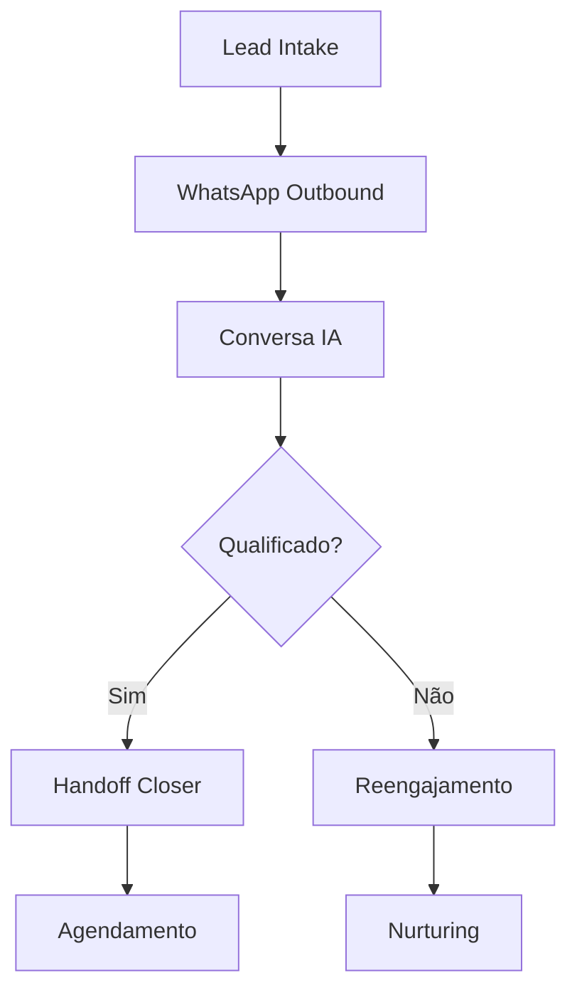

# 🤖 Agente IA Qualificador - Micro SaaS

> **Sistema completo de qualificação de leads via WhatsApp para escritórios de consultoria/assessoria de investimentos**

[](https://github.com/EduardoSousaPO/agente-ia-qualificador)
[](https://github.com/EduardoSousaPO/agente-ia-qualificador)
[](LICENSE)

## 🎯 **Visão Geral**

Sistema **plug-and-play** que automatiza a qualificação de leads através de conversas naturais no WhatsApp, utilizando IA para identificar investidores qualificados e entregar leads prontos para closers com sugestões de agendamento.

### ✨ **Funcionalidades Principais**

- 🔄 **Intake Automático**: Recebe leads de YouTube, newsletters, landing pages e inbound WhatsApp
- 📝 **Gestão Manual**: Interface para adicionar leads individuais ou em lote (CSV)
- 🤖 **Conversas Naturais**: IA conduz qualificação via WhatsApp (patrimônio, objetivo, urgência)
- 📊 **Scoring Inteligente**: Sistema de pontuação automática para qualificação
- 🎯 **Handoff Qualificado**: Entrega leads prontos com sugestões de horários
- 📱 **Dashboard Completo**: Interface Next.js para gestão e analytics

## 🏗️ **Arquitetura**

```
┌─────────────────┐    ┌──────────────┐    ┌─────────────────┐
│   Frontend      │    │   Backend    │    │   Integrações   │
│   (Next.js)     │◄──►│   (Flask)    │◄──►│   Supabase      │
│                 │    │              │    │   Twilio        │
│   - Dashboard   │    │   - API      │    │   OpenAI        │
│   - Leads CRUD  │    │   - Webhooks │    │   N8N           │
│   - Analytics   │    │   - IA Logic │    │                 │
└─────────────────┘    └──────────────┘    └─────────────────┘
```

### 🛠️ **Stack Tecnológica**

- **Frontend**: Next.js 15 + TypeScript + Tailwind CSS
- **Backend**: Flask (Python) + SQLAlchemy
- **Database**: Supabase (PostgreSQL) + Row Level Security
- **Auth**: Supabase Auth + JWT
- **Messaging**: Twilio WhatsApp Business API
- **AI**: OpenAI GPT-4o / GPT-4o-mini
- **Automation**: N8N workflows
- **Deploy**: Vercel

## 🚀 **Início Rápido**

### **Pré-requisitos**

- Python 3.11+
- Node.js 18+
- Conta Supabase
- Conta OpenAI
- Conta N8N (opcional)

### **1. Clonar o Repositório**

```bash
git clone https://github.com/EduardoSousaPO/agente-ia-qualificador.git
cd agente-ia-qualificador
```

### **2. Configurar Backend**

```bash
cd backend

# Instalar dependências
pip install -r requirements.txt

# Configurar variáveis de ambiente
cp .env.example .env
# Editar .env com suas credenciais

# Iniciar servidor
python app.py
```

### **3. Configurar Frontend**

```bash
cd frontend

# Instalar dependências
npm install

# Configurar variáveis de ambiente
cp .env.example .env.local
# Editar .env.local com suas credenciais

# Iniciar aplicação
npm run dev
```

### **4. Acessar Sistema**

- **Frontend**: http://localhost:3000
- **Backend API**: http://localhost:5000
- **Credenciais Demo**: `admin@demo.com` / `demo123`

## 📋 **Configuração**

### **Variáveis de Ambiente**

#### **Backend (.env)**
```env
# Supabase
SUPABASE_URL=https://seu-projeto.supabase.co
SUPABASE_SERVICE_ROLE_KEY=sua-service-key

# OpenAI
OPENAI_API_KEY=sk-sua-chave-openai
OPENAI_MODEL=gpt-4o-mini

# Twilio (opcional - sistema tem simulador)
TWILIO_ACCOUNT_SID=seu-account-sid
TWILIO_AUTH_TOKEN=seu-auth-token
USE_WHATSAPP_SIMULATOR=true

# N8N (opcional)
N8N_WEBHOOK_URL_INTAKE=https://seu-workspace.app.n8n.cloud/webhook/intake-lead
```

#### **Frontend (.env.local)**
```env
NEXT_PUBLIC_SUPABASE_URL=https://seu-projeto.supabase.co
NEXT_PUBLIC_SUPABASE_ANON_KEY=sua-anon-key
NEXT_PUBLIC_API_URL=http://localhost:5000/api
```

## 🗄️ **Banco de Dados**

O sistema utiliza **Supabase** com as seguintes tabelas:

- `tenants` - Multi-tenancy
- `users` - Usuários e roles
- `leads` - Leads e informações
- `sessions` - Sessões de conversa
- `messages` - Mensagens WhatsApp
- `qualificacoes` - Dados de qualificação
- `meetings` - Agendamentos
- `audit_events` - Auditoria

### **Configurar Banco**

1. Criar projeto no [Supabase](https://supabase.com)
2. Executar SQL do arquivo `database/schema.sql`
3. Configurar RLS (Row Level Security)

## 📱 **Uso do Sistema**

### **1. Dashboard Principal**
- Visualizar métricas em tempo real
- Acompanhar conversão de leads
- Analytics de performance

### **2. Gestão de Leads**
- **Manual**: Adicionar leads individuais
- **Bulk**: Upload CSV com múltiplos leads
- **Automático**: Receber via webhooks/formulários

### **3. Conversas WhatsApp**
- Sistema conduz qualificação automaticamente
- Operador pode assumir controle (takeover)
- Histórico completo de mensagens

### **4. Qualificação IA**
Critérios avaliados:
- 💰 **Patrimônio**: Faixa de investimento disponível
- 🎯 **Objetivo**: Metas de investimento
- ⏰ **Urgência**: Prazo para começar
- 🤝 **Interesse**: Disposição para falar com especialista

### **5. Handoff para Closers**
- Lead qualificado entregue automaticamente
- 2 sugestões de horário incluídas
- Notificações via Slack/Email/CRM

## 🔄 **Fluxo Operacional**



## 🧪 **Testes**

### **Executar Testes Completos**

```bash
# Teste completo do sistema
python test_sistema_completo_final.py

# Teste específico do backend
python test_backend_simple.py

# Teste de fluxo completo
python test_flow_complete.py
```

### **Resultado Esperado**
```
✅ 7/7 testes passaram
🎉 TODOS OS TESTES PASSARAM!
✅ Sistema está 100% funcional
```

## 📊 **KPIs Monitorados**

- ⏱️ **Tempo de Ingestão**: Lead → Primeira mensagem
- 📈 **Taxa de Resposta**: % que respondem à primeira mensagem
- 🎯 **Taxa de Qualificação**: % qualificados / total
- 📅 **Reuniões Agendadas**: % agendadas / qualificados

## 🔧 **Desenvolvimento**

### **Estrutura do Projeto**

```
agente-ia-qualificador/
├── backend/                 # API Flask
│   ├── app.py              # Aplicação principal
│   ├── services/           # Serviços (Supabase, Twilio, OpenAI)
│   └── requirements.txt    # Dependências Python
├── frontend/               # Interface Next.js
│   ├── src/app/           # App Router
│   ├── src/components/    # Componentes React
│   └── package.json       # Dependências Node.js
├── database/              # Schema e migrações
├── n8n/                  # Workflows N8N
└── scripts/              # Scripts de teste
```

### **Contribuindo**

1. Fork o projeto
2. Criar branch feature (`git checkout -b feature/nova-funcionalidade`)
3. Commit suas mudanças (`git commit -m 'Adicionar nova funcionalidade'`)
4. Push para branch (`git push origin feature/nova-funcionalidade`)
5. Abrir Pull Request

## 📄 **Licença**

Este projeto está sob a licença MIT. Veja o arquivo [LICENSE](LICENSE) para detalhes.

## 🤝 **Suporte**

- 📧 **Email**: eduardo.sousa@exemplo.com
- 💬 **GitHub Issues**: [Reportar Bug](https://github.com/EduardoSousaPO/agente-ia-qualificador/issues)
- 📖 **Documentação**: [Wiki do Projeto](https://github.com/EduardoSousaPO/agente-ia-qualificador/wiki)

---

**⭐ Se este projeto foi útil, considere dar uma estrela no GitHub!**

---

*Desenvolvido com ❤️ para automatizar a qualificação de leads de investimentos*
