# 🗺️ **MAPA COMPLETO DE FUNCIONALIDADES - AGENTE QUALIFICADOR IA**

> **Guia Visual Completo: N8N vs Backend, Fluxos, Processos e Exemplos Práticos**  
> *Documentação Técnica Visual - Janeiro 2025*

---

## 📋 **ÍNDICE**

1. [🎯 Visão Geral do Sistema](#-visão-geral-do-sistema)
2. [🏗️ Arquitetura Híbrida](#️-arquitetura-híbrida)
3. [🔄 Fluxos Principais](#-fluxos-principais)
4. [🤖 Funcionalidades de IA](#-funcionalidades-de-ia)
5. [📊 Mapeamento N8N vs Backend](#-mapeamento-n8n-vs-backend)
6. [💬 Exemplos de Conversas](#-exemplos-de-conversas)
7. [🎨 Interfaces do Sistema](#-interfaces-do-sistema)
8. [⚡ Fluxo de Dados Completo](#-fluxo-de-dados-completo)

---

## 🎯 **VISÃO GERAL DO SISTEMA**

### **📊 Diagrama de Arquitetura Completa**

```mermaid
graph TB
    subgraph "🌐 ENTRADAS"
        A1[📥 Lead Forms]
        A2[📱 WhatsApp Inbound]
        A3[📄 CSV Upload]
        A4[✏️ Manual Input]
    end
    
    subgraph "🔄 N8N WORKFLOWS"
        B1[📥 Intake Workflow]
        B2[🤖 WhatsApp AI Agent]
        B3[🔔 Notification Workflow]
    end
    
    subgraph "🏗️ BACKEND FLASK"
        C1[🧠 Knowledge Base]
        C2[🔄 Feedback System]
        C3[📈 Analytics Engine]
        C4[🎛️ Admin APIs]
    end
    
    subgraph "🗄️ DATABASE"
        D1[📊 Supabase PostgreSQL]
        D2[🔐 RLS Security]
        D3[📋 10 Tabelas]
    end
    
    subgraph "🎨 FRONTEND"
        E1[📱 Dashboard]
        E2[💬 Chat Interface]
        E3[⚙️ Settings Panel]
        E4[📊 Analytics View]
    end
    
    subgraph "🔗 INTEGRAÇÕES"
        F1[🤖 OpenAI GPT-4o]
        F2[📱 Twilio WhatsApp]
        F3[📧 SMTP Email]
        F4[🔗 Generic CRM]
    end
    
    A1 --> B1
    A2 --> B2
    A3 --> C4
    A4 --> E1
    
    B1 --> D1
    B2 --> D1
    B3 --> C1
    
    B1 --> F1
    B2 --> F1
    B2 --> F2
    B3 --> F3
    B3 --> F4
    
    C1 --> D1
    C2 --> D1
    C3 --> D1
    C4 --> D1
    
    E1 --> C4
    E2 --> C4
    E3 --> C1
    E4 --> C3
```

---

## 🏗️ **ARQUITETURA HÍBRIDA**

### **⚖️ Divisão de Responsabilidades**

```mermaid
graph LR
    subgraph "🚀 N8N - PROCESSAMENTO RÁPIDO"
        N1[🤖 IA Conversacional]
        N2[📊 Scoring Dinâmico]
        N3[🔄 Automação de Fluxos]
        N4[📱 Integração WhatsApp]
        N5[🔔 Notificações Instantâneas]
    end
    
    subgraph "🧠 BACKEND - LÓGICA COMPLEXA"
        B1[🧠 Base de Conhecimento]
        B2[🔄 Sistema de Feedback]
        B3[📈 Analytics Avançado]
        B4[🎛️ Interface Administrativa]
        B5[🔐 Autenticação Multi-tenant]
    end
    
    N1 <--> B1
    N2 <--> B2
    N3 <--> B4
    N5 <--> B3
```

### **📊 Critérios de Decisão: N8N vs Backend**

| Funcionalidade | N8N | Backend | Motivo |
|----------------|-----|---------|---------|
| **IA Conversacional** | ✅ | ❌ | Performance + Visualização |
| **Scoring Automático** | ✅ | ❌ | Processamento paralelo |
| **Integração WhatsApp** | ✅ | ❌ | Automação nativa |
| **Base de Conhecimento** | ❌ | ✅ | Lógica complexa |
| **Sistema de Feedback** | ❌ | ✅ | Aprendizado supervisionado |
| **Dashboard Admin** | ❌ | ✅ | Interface rica |
| **Analytics** | ❌ | ✅ | Queries complexas |
| **Multi-tenancy** | ❌ | ✅ | Segurança + Isolamento |

---

## 🔄 **FLUXOS PRINCIPAIS**

### **1. 📥 FLUXO DE INTAKE DE LEADS**

```mermaid
sequenceDiagram
    participant L as 📥 Lead Source
    participant N as 🔄 N8N Intake
    participant AI as 🤖 OpenAI
    participant W as 📱 Twilio
    participant DB as 🗄️ Supabase
    
    L->>N: 📨 Dados do Lead
    N->>N: ✅ Validar Dados
    N->>DB: 💾 Criar Lead
    N->>DB: 💬 Criar Sessão
    N->>AI: 🤖 Gerar Boas-vindas
    AI-->>N: 📝 Mensagem Personalizada
    N->>W: 📱 Enviar WhatsApp
    N->>DB: 💾 Salvar Mensagem
    N-->>L: ✅ Confirmação
```

**🎯 Exemplo Prático:**
```json
// Entrada
{
  "name": "João Silva",
  "phone": "+5511999888777",
  "email": "joao@email.com",
  "origem": "newsletter"
}

// IA Gera
"Olá João! 👋 Obrigado por se cadastrar na nossa newsletter. 
Sou o assistente da [Empresa] e vou te ajudar a descobrir as 
melhores opções de investimento para seu perfil. 

Para começar, você poderia me contar quanto tem disponível 
para investir atualmente? 💰"
```

### **2. 🤖 FLUXO DE CONVERSA IA**

```mermaid
sequenceDiagram
    participant U as 👤 Usuário
    participant T as 📱 Twilio
    participant N as 🔄 N8N WhatsApp
    participant AI1 as 🤖 IA Qualificação
    participant AI2 as 📊 IA Scoring
    participant DB as 🗄️ Supabase
    participant B as 🏗️ Backend
    
    U->>T: 💬 Mensagem WhatsApp
    T->>N: 📨 Webhook Twilio
    N->>N: ✅ Filtrar Válidas
    N->>DB: 🔍 Buscar Lead
    N->>DB: 📜 Buscar Histórico
    N->>AI1: 🤖 Processar + Contexto
    AI1-->>N: 📝 Resposta Contextual
    N->>AI2: 📊 Calcular Score
    AI2-->>N: 🔢 Score 0-100
    N->>T: 📱 Enviar Resposta
    N->>DB: 💾 Salvar Conversa
    
    alt Score >= 70
        N->>N: 🎯 Lead Qualificado
        N->>DB: ✅ Atualizar Status
        N->>B: 🔔 Notificar Consultor
    end
```

**🎯 Exemplo de Conversa Completa:**

```
👤 USUÁRIO: "Tenho uns 200 mil guardados"

🤖 IA QUALIFICAÇÃO (Contexto: Patrimônio):
"Excelente, João! R$ 200 mil é um valor interessante para 
começar a investir. Agora me conta: qual é seu principal 
objetivo com esses investimentos? 🎯

A) Gerar renda mensal para complementar salário
B) Fazer o dinheiro crescer para aposentadoria  
C) Preservar o valor contra inflação
D) Deixar herança para os filhos"

📊 IA SCORING (Análise):
- Patrimônio: R$ 200k = 25 pontos (de 30)
- Resposta clara e objetiva = +5 pontos
- SCORE PARCIAL: 30/100
```

### **3. 🔔 FLUXO DE NOTIFICAÇÃO**

```mermaid
sequenceDiagram
    participant N as 🔄 N8N Qualified
    participant B as 🏗️ Backend Hook
    participant E as 📧 Email Service
    participant C as 🔗 CRM Adapter
    participant S as 📊 Supabase
    
    N->>B: 🔔 Lead Qualificado
    B->>S: 📊 Buscar Dados Completos
    B->>E: 📧 Preparar Email
    E->>E: ✉️ Enviar para Consultor
    B->>C: 🔗 Atualizar CRM
    C->>C: 📝 Webhook/Sheets/Notion
    B-->>N: ✅ Confirmação
```

**🎯 Exemplo de Email Automático:**
```
📧 ASSUNTO: 🎯 LEAD QUALIFICADO - João Silva (Score: 85)

Olá Consultor,

Um novo lead foi qualificado pelo nosso sistema:

👤 DADOS:
Nome: João Silva
Telefone: +55 11 99988-7777
Email: joao@email.com
Score: 85/100 ⭐

💰 QUALIFICAÇÃO:
✅ Patrimônio: R$ 200.000 disponível
✅ Objetivo: Aposentadoria (longo prazo)
✅ Urgência: Quer começar este mês
✅ Interesse: Muito interessado em assessoria

🎯 RECOMENDAÇÃO:
Lead PREMIUM - Agendar reunião PRIORITÁRIA
```

---

## 🤖 **FUNCIONALIDADES DE IA**

### **1. 🧠 IA CONVERSACIONAL (N8N)**

#### **🎯 Características:**
- **Modelo**: GPT-4o-mini
- **Contexto**: Histórico de 10 mensagens
- **Personalização**: Base de conhecimento por empresa
- **Fluxo**: 4 perguntas obrigatórias

#### **💬 Exemplo de Prompts:**

```javascript
// PROMPT SISTEMA (N8N)
`Você é um assistente especializado em qualificação de leads 
para escritórios de investimento. Faça perguntas específicas sobre:

1. PATRIMÔNIO: Qual valor disponível para investimento?
2. OBJETIVO: Busca renda passiva, crescimento ou preservação?
3. URGÊNCIA: Quando pretende começar a investir?
4. INTERESSE: Tem interesse em assessoria personalizada?

Seja cordial, profissional e focado. Analise as respostas e 
atribua um score de 0-100 baseado nos critérios:
- Patrimônio alto (>100k): +30 pontos
- Objetivo claro: +25 pontos  
- Urgência alta: +25 pontos
- Interesse em assessoria: +20 pontos`

// PROMPT USUÁRIO (N8N)
`Lead: João Silva
Mensagem atual: "Tenho uns 200 mil guardados"

Histórico recente:
outbound: Olá João! Quanto tem disponível para investir?
inbound: Tenho uns 200 mil guardados

Responda de forma contextual e continue o processo de qualificação.`
```

### **2. 📊 IA DE SCORING (N8N)**

#### **🎯 Características:**
- **Modelo**: GPT-4o-mini (temperatura baixa: 0.1)
- **Saída**: Número de 0-100
- **Critérios**: Patrimônio, Objetivo, Urgência, Interesse
- **Threshold**: ≥ 70 pontos = Qualificado

#### **📊 Exemplo de Scoring:**

```javascript
// PROMPT SCORING (N8N)
`Analise a conversa e extraia um score de qualificação de 0-100 
baseado nos critérios:
- Patrimônio disponível para investimento
- Objetivos claros de investimento
- Urgência para começar
- Interesse em assessoria

Retorne APENAS um número de 0 a 100.`

// ANÁLISE IA
Conversa: "Tenho 200k... quero aposentadoria... começar este mês... 
preciso de ajuda profissional"

// RESULTADO
85
```

### **3. 🧠 BASE DE CONHECIMENTO (BACKEND)**

#### **🎯 Características:**
- **Armazenamento**: Supabase por tenant
- **Injeção**: Contextualiza prompts da IA
- **Interface**: `/settings/knowledge`
- **Personalização**: Critérios específicos por empresa

#### **📝 Exemplo de Conhecimento:**

```markdown
## EMPRESA: InvestPro Consultoria

### CRITÉRIOS DE QUALIFICAÇÃO:
- Patrimônio mínimo: R$ 500.000
- Foco: Clientes acima de 40 anos
- Especialidade: Aposentadoria e sucessão

### PRODUTOS PRINCIPAIS:
- Carteiras diversificadas
- Fundos exclusivos
- Planejamento sucessório
- Previdência privada

### DIFERENCIAIS:
- 15 anos de mercado
- Certificação CNPI
- Atendimento personalizado
- Relatórios mensais detalhados
```

#### **🔄 Injeção no Prompt:**

```javascript
// BACKEND: qualification_service.py
def _inject_knowledge_in_prompt(base_prompt, knowledge):
    return f"""
CONTEXTO DA EMPRESA:
{knowledge}

FLUXO OBRIGATÓRIO:
{base_prompt}

IMPORTANTE: Use o contexto da empresa para responder dúvidas 
específicas, mas SEMPRE mantenha o fluxo de 4 perguntas obrigatórias.
"""
```

### **4. 🔄 SISTEMA DE FEEDBACK (BACKEND)**

#### **🎯 Características:**
- **Interface**: `/settings/feedback`
- **Ações**: Aprovar/Rejeitar mensagens
- **Aprendizado**: Padrões de aprovação
- **Melhoria**: Contínua baseada em feedback

#### **💡 Exemplo de Feedback:**

```json
// MENSAGEM PARA AVALIAÇÃO
{
  "agent_message": "Oi! Você tem quanto guardado para investir? 💰",
  "lead_name": "Maria Santos",
  "session_id": "uuid-123",
  "status": "pending"
}

// FEEDBACK DO ADMIN
{
  "status": "rejected",
  "notes": "Muito informal. Usar linguagem mais profissional.",
  "suggestion": "Olá Maria! Para oferecermos as melhores opções, poderia me informar qual valor tem disponível para investimentos?"
}
```

---

## 📊 **MAPEAMENTO N8N vs BACKEND**

### **🚀 PROCESSOS N8N (Automação + IA Rápida)**

#### **📥 Workflow 1: Intake Avançado**
```mermaid
flowchart TD
    A[📥 Webhook Lead] --> B{✅ Dados Válidos?}
    B -->|Sim| C[💾 Criar Lead Supabase]
    B -->|Não| D[❌ Erro 400]
    C --> E[💬 Criar Sessão]
    E --> F[🤖 IA Gerar Boas-vindas]
    F --> G[📱 Twilio Enviar]
    G --> H[💾 Salvar Mensagem]
    H --> I[✅ Resposta Sucesso]
```

**🔧 Configuração N8N:**
- **Nós**: 8 nós conectados
- **OpenAI**: Credencial configurada
- **Twilio**: Basic Auth (opcional)
- **Supabase**: Headers diretos

#### **🤖 Workflow 2: WhatsApp IA**
```mermaid
flowchart TD
    A[📱 Webhook Twilio] --> B{✅ Mensagem Válida?}
    B -->|Sim| C[🔍 Buscar Lead]
    B -->|Não| D[❌ Ignorar]
    C --> E{👤 Lead Existe?}
    E -->|Sim| F[📜 Buscar Histórico]
    E -->|Não| G[❌ Lead Não Encontrado]
    F --> H[🤖 IA Qualificação]
    H --> I[📊 IA Scoring]
    I --> J[📱 Enviar Resposta]
    J --> K[💾 Salvar Conversa]
    K --> L{🎯 Score >= 70?}
    L -->|Sim| M[✅ Qualificar Lead]
    L -->|Não| N[🔄 Continuar Conversa]
    M --> O[🔔 Notificar Consultor]
```

**🎯 Recursos Avançados:**
- **Dupla IA**: Qualificação + Scoring
- **Contexto**: 10 mensagens anteriores
- **Scoring dinâmico**: Baseado na conversa completa
- **Notificação automática**: Para leads qualificados

#### **🔔 Workflow 3: Notificação**
```mermaid
flowchart TD
    A[🔔 Webhook Qualified] --> B[🏗️ Backend Processor]
    B --> C{✅ Sucesso?}
    C -->|Sim| D[✅ Confirmação]
    C -->|Não| E[❌ Erro 500]
```

### **🏗️ PROCESSOS BACKEND (Lógica Complexa)**

#### **🧠 Sistema de Base de Conhecimento**
```python
# qualification_service.py
class QualificationService:
    def _get_knowledge_base_context(self, tenant_id: str) -> str:
        """Buscar conhecimento personalizado por empresa"""
        
    def _inject_knowledge_in_prompt(self, base_prompt: str, knowledge: str) -> str:
        """Injetar contexto no prompt da IA"""
        
    def _save_agent_message_for_feedback(self, session_id: str, agent_message: str):
        """Salvar mensagem para avaliação posterior"""
```

#### **🔄 Sistema de Feedback**
```python
# app/routes/feedback.py
@feedback_bp.route('/agent-feedback', methods=['POST'])
def create_feedback():
    """Registrar aprovação/rejeição de mensagem"""
    
@feedback_bp.route('/agent-feedback/<tenant_id>', methods=['GET'])
def get_feedback_history():
    """Histórico de feedback para análise"""
```

#### **📧 Sistema de Notificações**
```python
# app/routes/hooks.py
@hooks_bp.route('/qualified-lead', methods=['POST'])
def qualified_lead_notification():
    """Processar lead qualificado"""
    # 1. Enviar email para consultor
    # 2. Atualizar CRM configurado
    # 3. Registrar auditoria
```

---

## 💬 **EXEMPLOS DE CONVERSAS**

### **🎯 Conversa Tipo 1: Lead Qualificado (Score: 85)**

```
🤖 AGENTE: Olá João! 👋 Obrigado por se cadastrar. Sou o assistente 
da InvestPro e vou te ajudar a descobrir as melhores opções de 
investimento para seu perfil. Para começar, você poderia me contar 
quanto tem disponível para investir atualmente? 💰

👤 JOÃO: Tenho uns 200 mil guardados na poupança

🤖 AGENTE: Excelente, João! R$ 200 mil é um valor interessante para 
diversificar e fazer render mais. Agora me conta: qual é seu principal 
objetivo com esses investimentos? 🎯

A) Gerar renda mensal para complementar salário
B) Fazer o dinheiro crescer para aposentadoria  
C) Preservar o valor contra inflação
D) Deixar herança para os filhos

👤 JOÃO: B, quero garantir minha aposentadoria

🤖 AGENTE: Perfeito! Aposentadoria é um objetivo muito inteligente. 
Com R$ 200 mil e foco no longo prazo, temos excelentes opções. 
Quando você pretende começar a investir? ⏰

A) Imediatamente, esta semana
B) Dentro de 1 mês
C) Nos próximos 3 meses
D) Ainda não sei quando

👤 JOÃO: A, quero começar logo

🤖 AGENTE: Ótimo, João! Urgência é fundamental para bons resultados. 
Uma última pergunta: você gostaria de ter acompanhamento de um 
consultor especializado para otimizar seus investimentos? 👨‍💼

A) Sim, quero assessoria personalizada
B) Talvez, dependendo das condições
C) Prefiro investir sozinho
D) Não tenho interesse

👤 JOÃO: A, preciso de ajuda profissional

🤖 AGENTE: Perfeito, João! 🎉 Com base no seu perfil:
• R$ 200 mil disponível
• Foco em aposentadoria 
• Urgência para começar
• Interesse em assessoria

Você se qualifica para nossa consultoria especializada! Um dos nossos 
consultores certificados entrará em contato nas próximas horas para 
agendar uma conversa e apresentar as melhores estratégias para seu 
objetivo. Até logo! 👋

📊 SCORE FINAL: 85/100 ⭐ QUALIFICADO
```

### **🎯 Conversa Tipo 2: Lead Não Qualificado (Score: 35)**

```
🤖 AGENTE: Olá Maria! 👋 Obrigado por se cadastrar. Quanto você tem 
disponível para investir atualmente? 💰

👤 MARIA: Não tenho nada guardado ainda

🤖 AGENTE: Entendo, Maria. Começar a investir é sempre um bom objetivo! 
Qual seria seu principal objetivo se conseguisse juntar um valor? 🎯

👤 MARIA: Não sei, talvez comprar umas coisas

🤖 AGENTE: Compreendo. E quando você pretenderia começar a investir? ⏰

👤 MARIA: Não sei, talvez no futuro

🤖 AGENTE: Ok, Maria. E você teria interesse em conversar com um 
consultor sobre investimentos? 👨‍💼

👤 MARIA: Não, só queria saber mesmo

🤖 AGENTE: Obrigado pelo interesse, Maria! Quando estiver pronta para 
começar a investir, estaremos aqui para ajudar. Tenha um ótimo dia! 👋

📊 SCORE FINAL: 35/100 ❌ NÃO QUALIFICADO
```

---

## 🎨 **INTERFACES DO SISTEMA**

### **📱 Dashboard Principal**

```mermaid
graph TD
    A[📊 Dashboard Home] --> B[📈 Métricas Gerais]
    A --> C[📋 Leads Recentes]
    A --> D[💬 Conversas Ativas]
    A --> E[🎯 Taxa de Qualificação]
    
    B --> B1[👥 Total Leads]
    B --> B2[✅ Qualificados]
    B --> B3[📊 Score Médio]
    B --> B4[⏱️ Tempo Médio]
```

### **💬 Interface de Conversas**

```mermaid
graph TD
    A[💬 Chat Interface] --> B[📋 Lista de Sessões]
    A --> C[💭 Área de Conversa]
    A --> D[📊 Painel de Score]
    
    C --> C1[📥 Mensagens Inbound]
    C --> C2[📤 Mensagens Outbound]
    C --> C3[🤖 Status do Agente]
    
    D --> D1[📊 Score Atual]
    D --> D2[📈 Progresso 4 Perguntas]
    D --> D3[🎯 Status Qualificação]
```

### **⚙️ Painel de Configurações**

```mermaid
graph TD
    A[⚙️ Settings Panel] --> B[🧠 Base de Conhecimento]
    A --> C[🔄 Feedback do Agente]
    A --> D[👥 Empresa & Membros]
    A --> E[🔗 Integrações]
    
    B --> B1[📝 Editor de Conhecimento]
    B --> B2[💾 Salvar/Atualizar]
    B --> B3[📊 Status Configuração]
    
    C --> C1[📋 Lista de Mensagens]
    C --> C2[✅ Aprovar/Rejeitar]
    C --> C3[📈 Estatísticas]
```

---

## ⚡ **FLUXO DE DADOS COMPLETO**

### **🔄 Ciclo de Vida Completo de um Lead**

```mermaid
sequenceDiagram
    participant F as 📄 Formulário
    participant N1 as 📥 N8N Intake
    participant DB as 🗄️ Supabase
    participant W as 📱 WhatsApp
    participant U as 👤 Usuário
    participant N2 as 🤖 N8N WhatsApp
    participant AI as 🧠 OpenAI
    participant N3 as 🔔 N8N Notify
    participant B as 🏗️ Backend
    participant E as 📧 Email
    participant C as 👨‍💼 Consultor
    
    Note over F,C: 1. INTAKE INICIAL
    F->>N1: 📨 Dados Lead
    N1->>DB: 💾 Criar Lead
    N1->>AI: 🤖 Gerar Boas-vindas
    N1->>W: 📱 Enviar WhatsApp
    
    Note over W,N2: 2. CONVERSA IA
    U->>W: 💬 Resposta 1
    W->>N2: 📨 Webhook
    N2->>DB: 🔍 Buscar Contexto
    N2->>AI: 🤖 Processar + Score
    N2->>W: 📱 Pergunta 2
    
    U->>W: 💬 Resposta 2
    W->>N2: 📨 Webhook
    N2->>AI: 🤖 Processar + Score
    N2->>W: 📱 Pergunta 3
    
    U->>W: 💬 Resposta 3
    W->>N2: 📨 Webhook
    N2->>AI: 🤖 Processar + Score
    N2->>W: 📱 Pergunta 4
    
    U->>W: 💬 Resposta 4
    W->>N2: 📨 Webhook
    N2->>AI: 🤖 Score Final
    
    Note over N2,C: 3. QUALIFICAÇÃO
    alt Score >= 70
        N2->>DB: ✅ Qualificar Lead
        N2->>N3: 🔔 Trigger Notificação
        N3->>B: 🏗️ Processar
        B->>E: 📧 Email Consultor
        E->>C: 📨 Lead Qualificado
    else Score < 70
        N2->>DB: ❌ Não Qualificado
        N2->>W: 💬 Mensagem Educativa
    end
```

### **📊 Métricas e KPIs do Sistema**

#### **🎯 Métricas de Performance**

```mermaid
graph TD
    A[📊 MÉTRICAS SISTEMA] --> B[⚡ Performance]
    A --> C[🎯 Qualificação]
    A --> D[💬 Conversação]
    A --> E[🔄 Operacional]
    
    B --> B1[⏱️ Tempo Resposta IA: <2s]
    B --> B2[📱 Taxa Entrega WhatsApp: >95%]
    B --> B3[🔄 Uptime N8N: >99%]
    
    C --> C1[🎯 Taxa Qualificação: 15-25%]
    C --> C2[📊 Score Médio: 45-55]
    C --> C3[✅ Precisão IA: >90%]
    
    D --> D1[💬 Msgs por Conversa: 8-12]
    D --> D2[⏰ Duração Média: 15min]
    D --> D3[🔄 Taxa Conclusão: >80%]
    
    E --> E1[📈 Leads/Dia: 50-200]
    E --> E2[💰 Custo por Lead: R$2-5]
    E --> E3[🚀 ROI: 300-500%]
```

---

## 🎯 **RESUMO EXECUTIVO**

### **✅ FUNCIONALIDADES IMPLEMENTADAS**

| Componente | Status | Localização | Responsabilidade |
|------------|--------|-------------|------------------|
| **🤖 IA Conversacional** | ✅ | N8N | Qualificação automática |
| **📊 Sistema de Scoring** | ✅ | N8N | Avaliação 0-100 pontos |
| **🧠 Base de Conhecimento** | ✅ | Backend | Personalização por empresa |
| **🔄 Sistema de Feedback** | ✅ | Backend | Aprendizado supervisionado |
| **📱 Interface WhatsApp** | ✅ | N8N + Twilio | Automação completa |
| **🔔 Notificações** | ✅ | N8N + Backend | Email + CRM automático |
| **📊 Dashboard** | ✅ | Frontend | Visualização completa |
| **🔐 Multi-tenancy** | ✅ | Backend | Isolamento por empresa |

### **🚀 VANTAGENS DA ARQUITETURA HÍBRIDA**

#### **⚡ Performance:**
- **N8N**: Processamento IA em <2s
- **Backend**: Lógica complexa otimizada
- **Híbrido**: Melhor dos dois mundos

#### **🎨 Manutenibilidade:**
- **Visual**: Fluxos N8N fáceis de ajustar
- **Código**: Backend para lógica complexa
- **Separação**: Responsabilidades claras

#### **📈 Escalabilidade:**
- **N8N**: Automação nativa para volume
- **Backend**: Microserviços para complexidade
- **Database**: Supabase com RLS

---

## 🎉 **CONCLUSÃO**

O **Agente Qualificador IA** utiliza uma **arquitetura híbrida inovadora** que combina:

- 🚀 **N8N**: Para automação rápida e IA conversacional
- 🧠 **Backend**: Para lógica complexa e personalização
- 🎨 **Frontend**: Para interface rica e administrativa
- 🗄️ **Supabase**: Para persistência segura e escalável

**Resultado**: Sistema **completo**, **escalável** e **profissional** para qualificação automatizada de leads via WhatsApp.

---

*📋 Documentação criada em Janeiro 2025 | Sistema 100% funcional e em produção*


