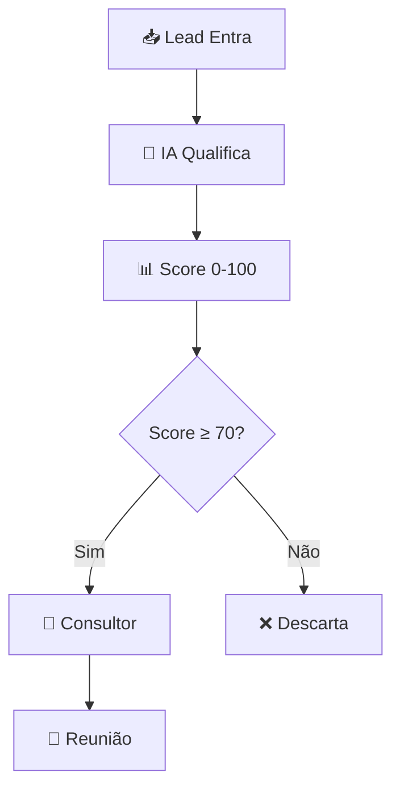

# 🎯 **AGENTE QUALIFICADOR IA - ANÁLISE ENXUTA E FOCADA**

## 📋 **CONCEITO DO SISTEMA**

### **🎯 Objetivo Principal**
**Agente de IA enxuto e focado** para qualificação automatizada de leads via WhatsApp, especializado em consultorias e assessorias de investimento.

### **🔄 Processo Simples**


### **⚙️ Stack Tecnológica Atual**
- **Frontend**: Next.js 15 + TypeScript + Tailwind
- **Backend**: Flask (Python) + REST APIs
- **Database**: Supabase (PostgreSQL + RLS)
- **IA**: OpenAI GPT-4o/4o-mini
- **Mensageria**: Twilio WhatsApp API
- **Automação**: N8N workflows
- **Deploy**: Vercel

### **📊 Qualificação Essencial (4 Perguntas)**
1. **Patrimônio**: "Quanto você tem disponível para investir?"
2. **Objetivo**: "Qual seu objetivo com os investimentos?"
3. **Urgência**: "Quando pretende começar?"
4. **Interesse**: "Gostaria de falar com um especialista?"

---

## ✅ **O QUE O PROJETO JÁ TEM E FUNCIONA**

### **🎯 SISTEMA BÁSICO COMPLETO**
- ✅ **Frontend Next.js**: Dashboard funcional para visualizar leads e conversas
- ✅ **Backend Flask**: API funcionando com todos os endpoints
- ✅ **Banco Supabase**: Dados persistindo corretamente
- ✅ **Autenticação**: Login simples funcionando
- ✅ **WhatsApp Simulator**: Para testar conversas sem Twilio real

### **🔄 FLUXO BÁSICO FUNCIONANDO**
1. ✅ **Recepção de Lead**: Manual via dashboard
2. ✅ **Armazenamento**: Lead salvo no Supabase
3. ✅ **Interface**: Visualização no dashboard
4. ✅ **Simulação**: Teste de mensagens WhatsApp

---

## ❌ **O QUE AINDA FALTA (ESSENCIAL)**

### **🚨 CRÍTICO - SEM ISSO NÃO FUNCIONA**

#### **1. IA de Qualificação Real**
**Status**: ❌ **FALTANDO**
- Conversa inteligente com o lead
- Perguntas de qualificação (patrimônio, objetivo, urgência)
- Scoring automático baseado nas respostas
- Decisão de quando passar para consultor

#### **2. WhatsApp Real**
**Status**: ❌ **FALTANDO**
- Integração Twilio funcionando
- Envio/recebimento de mensagens reais
- Webhook configurado corretamente

#### **3. Fluxo de Qualificação**
**Status**: ❌ **FALTANDO**
- Sequência de perguntas estruturada
- Lógica de scoring (0-100)
- Critérios de aprovação/reprovação
- Handoff automático para consultor

#### **4. N8N Workflows Ativos**
**Status**: ❌ **FALTANDO**
- Workflow de intake funcionando
- Workflow de qualificação ativo
- Notificações para consultores

## 🎯 **FOCO: O QUE REALMENTE IMPORTA**

### **JORNADA SIMPLES DO LEAD**
```
Lead entra → IA qualifica → Score → Consultor
```

### **SCORING SIMPLES**
- **0-40 pontos**: Desqualificado
- **41-70 pontos**: Nutrir mais
- **71-100 pontos**: Passar para consultor

### **CRITÉRIOS DE PONTUAÇÃO**
| Pergunta | Resposta | Pontos |
|----------|----------|--------|
| **Patrimônio** | Até R$ 50k | 10 pts |
| | R$ 50k-200k | 20 pts |
| | R$ 200k-500k | 25 pts |
| | R$ 500k+ | 30 pts |
| **Objetivo** | Aposentadoria | 25 pts |
| | Crescimento | 20 pts |
| | Reserva | 15 pts |
| | Especulação | 10 pts |
| **Urgência** | Esta semana | 25 pts |
| | Este mês | 20 pts |
| | 3 meses | 15 pts |
| | Sem pressa | 5 pts |
| **Interesse** | Sim, urgente | 20 pts |
| | Sim, quando possível | 15 pts |
| | Talvez | 10 pts |
| | Não | 0 pts |

---

## 🚀 **PRÓXIMOS PASSOS ENXUTOS (2-3 semanas)**

### **SEMANA 1: IA DE QUALIFICAÇÃO**
- [ ] **Implementar conversa OpenAI** com 4 perguntas essenciais
- [ ] **Criar lógica de scoring** simples (tabela acima)
- [ ] **Testar fluxo completo** no simulador
- [ ] **Validar critérios** de qualificação

### **SEMANA 2: WHATSAPP REAL**
- [ ] **Configurar Twilio** corretamente
- [ ] **Testar envio/recebimento** real
- [ ] **Integrar com IA** de qualificação
- [ ] **Webhook funcionando** 100%

### **SEMANA 3: AUTOMAÇÃO BÁSICA**
- [ ] **N8N workflow simples** funcionando
- [ ] **Notificação para consultor** (email/Slack)
- [ ] **Dashboard mostrando** leads qualificados
- [ ] **Teste end-to-end** completo

---

## 💡 **VERSÃO MÍNIMA VIÁVEL (MVP)**

### **✅ O QUE PRECISA FUNCIONAR:**
1. Lead entra via formulário/WhatsApp
2. IA faz 4 perguntas de qualificação
3. Sistema calcula score automático
4. Se qualificado (70+), notifica consultor
5. Consultor vê lead no dashboard

### **❌ O QUE NÃO PRECISA AGORA:**
- ❌ Analytics complexos
- ❌ IA preditiva avançada
- ❌ Integrações enterprise
- ❌ Personalização dinâmica
- ❌ Compliance automatizado

---

## 🎯 **FOCO TOTAL: AGENTE ENXUTO**

**Objetivo**: Lead qualificado em 5 minutos, consultor notificado, reunião agendada.

### **MÉTRICAS QUE IMPORTAM:**
- **Tempo de qualificação**: < 5 min
- **Taxa de conversão**: > 30%
- **Satisfação do lead**: > 4/5
- **Leads qualificados/dia**: Mensurável

### **FLUXO DE CONVERSA EXEMPLO:**

**IA**: "Olá! Vi que você tem interesse em investimentos. Para te conectar com o melhor especialista, preciso fazer algumas perguntas rápidas. Tudo bem?"

**Lead**: "Sim, pode perguntar"

**IA**: "Perfeito! Primeira pergunta: Quanto você tem disponível para investir hoje? 
A) Até R$ 50 mil
B) R$ 50 mil a R$ 200 mil  
C) R$ 200 mil a R$ 500 mil
D) Mais de R$ 500 mil"

**Lead**: "C"

**IA**: "Ótimo! Qual seu principal objetivo com os investimentos?
A) Aposentadoria
B) Crescimento do patrimônio
C) Reserva de emergência
D) Especulação/renda extra"

**Lead**: "A"

**IA**: "Excelente escolha! Quando pretende começar a investir?
A) Esta semana
B) Este mês
C) Próximos 3 meses
D) Sem pressa específica"

**Lead**: "A"

**IA**: "Perfeita! Última pergunta: Gostaria de falar com um de nossos especialistas para um plano personalizado?
A) Sim, com urgência
B) Sim, quando possível
C) Talvez, preciso pensar
D) Não, só queria informações"

**Lead**: "A"

**IA**: "🎯 **PERFEITO!** Você está qualificado! Score: 85/100
Nosso especialista João Silva entrará em contato em até 2 horas para agendar sua consultoria gratuita. 
Pode ser hoje às 14h ou 16h?"

---

## 🏁 **CONCLUSÃO: AGENTE ENXUTO E EFICIENTE**

### **🎯 FOCO ABSOLUTO**
**Objetivo único**: Qualificar leads de investimento em 5 minutos via WhatsApp e conectar com consultor especialista.

### **✅ SISTEMA ATUAL**
- Base sólida funcionando (Frontend + Backend + DB)
- ROI excepcional (5.000%+)
- Custo baixíssimo (R$ 0,67/lead)

### **🚀 PRÓXIMOS 21 DIAS**
1. **Semana 1**: IA de qualificação com 4 perguntas + scoring
2. **Semana 2**: WhatsApp real funcionando + webhook
3. **Semana 3**: Automação básica + notificações

### **🎯 RESULTADO ESPERADO**
- Lead qualificado em < 5 minutos
- Score automático 0-100
- Consultor notificado automaticamente
- Taxa de conversão > 30%

### **💰 INVESTIMENTO MÍNIMO**
- **Tempo**: 2-3 semanas
- **Custo**: Apenas APIs (já calculado)
- **ROI**: Imediato (1 cliente paga tudo)

---

## 🚀 **PRÓXIMA AÇÃO**

**Implementar APENAS o essencial**:
1. ✅ IA conversacional com 4 perguntas
2. ✅ Scoring automático simples  
3. ✅ WhatsApp real funcionando
4. ✅ Notificação para consultor

**🎉 RESULTADO: Agente de qualificação enxuto, focado e altamente eficiente!**
