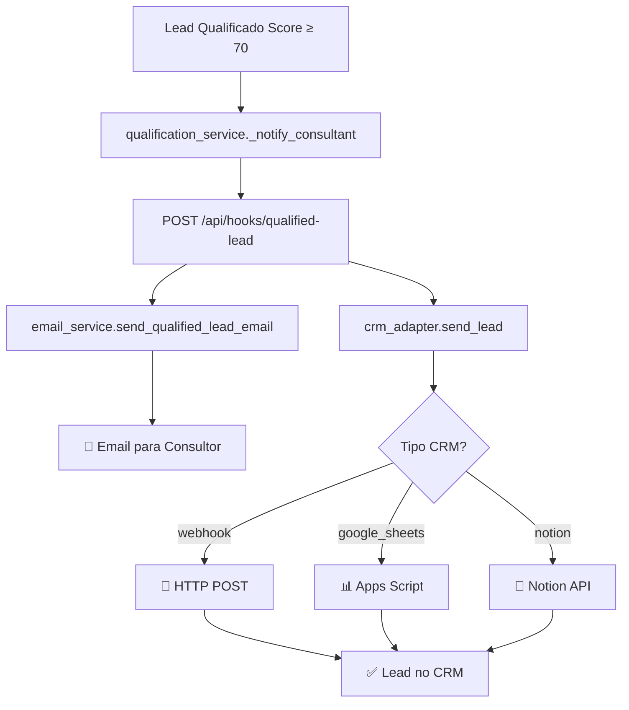

# 🔗 Integrações CRM - Agente Qualificador

## 📋 Visão Geral

O sistema suporta integração com diferentes CRMs através de configuração por tenant. Quando um lead é qualificado (score ≥ 70), o sistema automaticamente:

1. 📧 **Envia email** para o consultor responsável
2. 🔗 **Envia dados** para o CRM configurado

---

## ⚙️ Configuração por Tenant

As configurações são armazenadas no campo `settings.crm` da tabela `tenants`:

```json
{
  "crm": {
    "type": "webhook|google_sheets_webhook|notion",
    "url": "https://...",
    "authHeader": "Bearer token-aqui",
    "database_id": "notion-database-id",
    "token": "notion-token"
  },
  "default_consultant_email": "consultor@empresa.com"
}
```

---

## 🎯 Tipos de CRM Suportados

### 1. 🔗 Webhook Genérico

**Mais flexível** - Funciona com qualquer sistema que aceite webhooks.

#### Configuração:
```json
{
  "type": "webhook",
  "url": "https://seu-crm.com/webhook/leads",
  "authHeader": "Bearer seu-token-aqui"
}
```

#### Payload enviado:
```json
{
  "event": "qualified_lead",
  "timestamp": "2025-01-25T20:00:00.000Z",
  "lead": {
    "id": "lead-uuid",
    "name": "Nome do Lead",
    "email": "lead@email.com", 
    "phone": "+55 11 99999-9999",
    "score": 85,
    "status": "qualificado",
    "origem": "WhatsApp",
    "created_at": "2025-01-25T19:30:00.000Z"
  },
  "source": "agente-qualificador-ia"
}
```

#### Exemplos de URLs:
- **HubSpot**: `https://api.hubapi.com/webhooks/v1/your-webhook-id`
- **Pipedrive**: `https://api.pipedrive.com/v1/webhooks/your-webhook-id`
- **Webhook.site** (teste): `https://webhook.site/unique-id`

---

### 2. 📊 Google Sheets (via Apps Script)

**Simples e visual** - Adiciona leads diretamente em planilha.

#### Passo 1: Criar Apps Script

1. Acesse [script.google.com](https://script.google.com)
2. Criar novo projeto
3. Cole o código:

```javascript
function doPost(e) {
  try {
    const data = JSON.parse(e.postData.contents);
    
    if (data.action === 'add_lead') {
      const sheet = SpreadsheetApp.openById('SEU-SHEET-ID').getActiveSheet();
      
      // Adicionar cabeçalhos se necessário
      if (sheet.getLastRow() === 0) {
        sheet.appendRow(['Nome', 'Email', 'Telefone', 'Score', 'Status', 'Origem', 'Data']);
      }
      
      // Adicionar dados do lead
      sheet.appendRow(data.data);
      
      return ContentService
        .createTextOutput(JSON.stringify({success: true}))
        .setMimeType(ContentService.MimeType.JSON);
    }
    
    return ContentService
      .createTextOutput(JSON.stringify({success: false, error: 'Invalid action'}))
      .setMimeType(ContentService.MimeType.JSON);
      
  } catch (error) {
    return ContentService
      .createTextOutput(JSON.stringify({success: false, error: error.toString()}))
      .setMimeType(ContentService.MimeType.JSON);
  }
}
```

#### Passo 2: Configurar webhook

1. **Salvar** o script
2. **Implantar** → Como aplicativo web
3. **Executar como**: Sua conta
4. **Quem tem acesso**: Qualquer pessoa
5. **Copiar URL** do webhook

#### Configuração no sistema:
```json
{
  "type": "google_sheets_webhook",
  "url": "https://script.google.com/macros/s/SEU-SCRIPT-ID/exec"
}
```

---

### 3. 📝 Notion Database

**Organizado e colaborativo** - Cria páginas automaticamente.

#### Passo 1: Criar integração Notion

1. Acesse [notion.so/my-integrations](https://notion.so/my-integrations)
2. **Criar nova integração**
3. **Copiar token** (inicia com `secret_`)

#### Passo 2: Preparar database

1. Criar database no Notion com colunas:
   - **Nome** (Title)
   - **Email** (Email)
   - **Telefone** (Phone)
   - **Score** (Number)
   - **Status** (Select)
   - **Origem** (Select)

2. **Compartilhar** database com sua integração
3. **Copiar Database ID** da URL

#### Configuração no sistema:
```json
{
  "type": "notion",
  "token": "secret_seu-token-notion",
  "database_id": "seu-database-id-notion"
}
```

---

## 🧪 Testes

### Teste Completo (Email + CRM)
```bash
python test_n8n_email_crm.py
```

### Teste apenas CRM
```bash
curl -X POST http://localhost:5000/api/hooks/test-crm \
  -H "Content-Type: application/json" \
  -d '{"tenant_id": "seu-tenant-id"}'
```

### Teste apenas Email
```bash
curl -X POST http://localhost:5000/api/hooks/test-email \
  -H "Content-Type: application/json" \
  -d '{"to_email": "teste@exemplo.com"}'
```

---

## 🔧 Configuração SMTP (Email)

Para emails reais, configure no `.env.local.backend`:

```env
# Gmail (recomendado)
SMTP_HOST=smtp.gmail.com
SMTP_PORT=587
SMTP_USER=seu-email@gmail.com
SMTP_PASS=sua-senha-de-app
FROM_EMAIL=seu-email@gmail.com

# Outlook
SMTP_HOST=smtp-mail.outlook.com
SMTP_PORT=587
SMTP_USER=seu-email@outlook.com
SMTP_PASS=sua-senha
FROM_EMAIL=seu-email@outlook.com
```

**⚠️ Gmail**: Use **senhas de app**, não a senha da conta.

---

## 🎯 Fluxo Completo



---

## 📊 Monitoramento

### Logs do Sistema
```bash
# Ver logs em tempo real
tail -f backend/logs/app.log | grep -E "(qualified-lead|email|crm)"
```

### Endpoints de Status
- `GET /api/hooks/health` - Status dos webhooks
- `POST /api/hooks/test-crm` - Testar CRM
- `POST /api/hooks/test-email` - Testar email

---

## ❓ Troubleshooting

### ❌ CRM não recebe leads
1. **Verificar configuração**: `settings.crm` no tenant
2. **Testar URL**: Usar `curl` ou Postman
3. **Verificar logs**: Procurar erros de conexão
4. **Validar token**: Autorização correta

### ❌ Emails não chegam
1. **SMTP configurado**: Verificar `.env.local.backend`
2. **Senha de app**: Gmail requer senha específica
3. **Firewall**: Porta 587 liberada
4. **Spam**: Verificar caixa de spam

### ❌ Webhook timeout
1. **URL válida**: CRM respondendo
2. **Timeout**: Aumentar em `crm_adapter.py`
3. **Rate limit**: CRM pode ter limite de requests

---

## 🚀 Próximos Passos

1. **Configurar CRM real** via `/settings/empresa`
2. **Testar com lead qualificado** (score ≥ 70)
3. **Monitorar logs** para debugging
4. **Configurar SMTP** para emails reais

**Status**: ✅ Sistema pronto para produção

